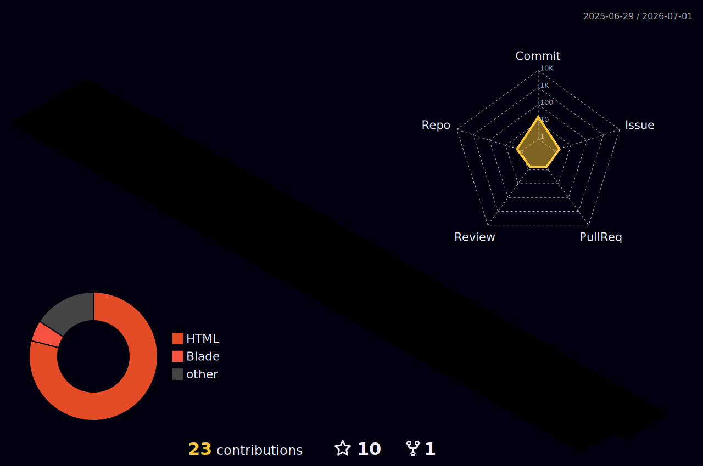

<!-- ═══════════════════════════════════════════════════════════════ -->
<!--                     HEADER / BANNER                           -->
<!-- ═══════════════════════════════════════════════════════════════ -->

<div align="center">


</div>

<!-- ═══════════════════════════════════════════════════════════════ -->
<!--                    TYPING ANIMATION                           -->
<!-- ═══════════════════════════════════════════════════════════════ -->

<div align="center">

<a href="https://git.io/typing-svg">
  
</a>

</div>

<br/>

<!-- ═══════════════════════════════════════════════════════════════ -->
<!--                   QUICK STATS BADGES                          -->
<!-- ═══════════════════════════════════════════════════════════════ -->

<div align="center">

[](https://github.com/vamsikrishna71)&nbsp;
[](https://github.com/vamsikrishna71)&nbsp;
[](https://dev.to/vamsikrishna71)&nbsp;
[](mailto:vamsicse0@gmail.com)

</div>

<br/>

---

<!-- ═══════════════════════════════════════════════════════════════ -->
<!--               ABOUT ME + GIF  (two-column)                    -->
<!-- ═══════════════════════════════════════════════════════════════ -->

<table width="100%" border="0" cellspacing="0" cellpadding="0">
<tr>

### 👾 &nbsp;About Me

```yaml
name       : Vamsi Krishna V
location   : Chennai, Tamil Nadu, India
role       : Developer & Analyst
focus      : RESTful APIs, Full-Stack, Data
email      : vamsicse0@gmail.com
```

<br/>

- 🏗️ &nbsp;**Journey:** Infiniti `2019` ✈️ SS4U Corp `2021` 🚀 Salt Player `2024–now`
- 🌐 &nbsp;**Frontend Lab:** [Portfolio](http://vamsikrishna71.github.io)
- 📖 &nbsp;**Technical Writer** on [Dev.to](https://dev.to/vamsikrishna71) — software architecture & dev
- ☁️ &nbsp;**Participant** — FOSS ASIA Cloud Skills Challenge 2022
- 💬 &nbsp;Always open to collaborate — reach me at [vamsicse0@gmail.com](mailto:vamsicse0@gmail.com)
</tr>
</table>

<br/>

---

<!-- ═══════════════════════════════════════════════════════════════ -->
<!--                       TECH STACK                              -->
<!-- ═══════════════════════════════════════════════════════════════ -->

### 🛠️ &nbsp;Tech Stack

<details open>
<summary><b>Languages & Frameworks</b></summary>
<br/>


</details>

<details open>
<summary><b>Data & Databases</b></summary>
<br/>


</details>

<details open>
<summary><b>DevOps & Tools</b></summary>
<br/>


</details>

<details>
<summary><b>Cloud & Analytics</b></summary>
<br/>


</details>

<br/>

---

<!-- ═══════════════════════════════════════════════════════════════ -->
<!--                    EXPERIENCE TIMELINE                        -->
<!-- ═══════════════════════════════════════════════════════════════ -->

### 💼 &nbsp;Work Experience

```
◆ Salt Player                         Jun 2024 – Present
  Play Store Project Lead / Developer
  └─ International market expansion · translation management · release workflow optimization

◆ SS4U Corp                           May 2021 – Jun 2022
  Software Developer  |  Chennai, India
  └─ Laravel & PHP RESTful APIs · +30% mobile traffic · responsive design · code reviews

◆ Infiniti Software Solutions         May 2019 – Feb 2020
  Software Developer  |  Chennai, India
  └─ Airline SOAP & REST API integration · full-stack features · +25% user retention
```

<br/>

---

<!-- ═══════════════════════════════════════════════════════════════ -->
<!--                  PROJECTS & ARTICLES                          -->
<!-- ═══════════════════════════════════════════════════════════════ -->

### 🚀 &nbsp;Projects & Open Source

<table>
<tr>
<td width="50%" valign="top">

#### 📦 &nbsp;Plex Meta Manager
An open-source Python 3 wrapper for managing metadata, collections and playlists inside Plex Media Server.

[](https://github.com/vamsikrishna71/plex-metamanager)


</td>
</tr>
</table>

<br/>

---

<!-- ═══════════════════════════════════════════════════════════════ -->
<!--                    TECHNICAL ARTICLES                         -->
<!-- ═══════════════════════════════════════════════════════════════ -->

### ✍️ &nbsp;Technical Articles

<!-- dev.to article cards -->
<a href="https://dev.to/vamsikrishna71/supercharge-your-spreadsheet-skills-with-python-in-microsoft-excel-2b5b">
  
</a>

<br/><br/>

<a href="https://dev.to/vamsikrishna71/laravel-eloquent-multiple-dependent-model-13ba">
  
</a>

<br/><br/>

> 📌 More articles on [dev.to/vamsikrishna71](https://dev.to/vamsikrishna71) and [medium.com/@vamsicse0](http://www.medium.com/@vamsicse0)

<br/>

---

<!-- ═══════════════════════════════════════════════════════════════ -->
<!--                    CERTIFICATIONS                             -->
<!-- ═══════════════════════════════════════════════════════════════ -->

### 🏅 &nbsp;Certifications & Achievements

| Badge | Credential | Year |
|---|---|---|
| 🗄️ | Linux Foundation | 2024 |
| 🔐 | Cyber Security Fundamentals | 2024 |
| ⚛️ | Quantum Computing | 2023 |
| ☁️ | Participant — FOSS ASIA Cloud Skills Challenge | 2022 |

<br/>

---

<!-- ═══════════════════════════════════════════════════════════════ -->
<!--                      GITHUB TROPHIES                          -->
<!-- ═══════════════════════════════════════════════════════════════ -->

<!-- <div align="center">

<a href="(https://github.com/lucthienphong1120/github-trophies)">
  
</a>

</div>

<br/> -->

---

<!-- ═══════════════════════════════════════════════════════════════ -->
<!--                      GITHUB STATS                             -->
<!-- ═══════════════════════════════════════════════════════════════ -->

### 📊 &nbsp;GitHub Statistics

<div align="center">


&nbsp;


</div>

<div align="center">


</div>

<br/>

---

<!-- ═══════════════════════════════════════════════════════════════ -->
<!--                    CONTRIBUTION SNAKE                         -->
<!-- ═══════════════════════════════════════════════════════════════ -->

### 🐍 &nbsp;Contribution Snake

<div align="center">

<picture>
  <source media="(prefers-color-scheme: dark)" srcset="https://github.com/vamsikrishna71/vamsikrishna71/blob/main/snake.svg" />
  <source media="(prefers-color-scheme: light)" srcset="https://github.com/vamsikrishna71/vamsikrishna71/blob/main/snake.svg" />
  
</picture>

</div>

<br/>

---

<!-- ═══════════════════════════════════════════════════════════════ -->
<!--                   3D CONTRIBUTION GRAPH                       -->
<!-- ═══════════════════════════════════════════════════════════════ -->

### 🌐 &nbsp;3D Contribution Graph

<div align="center">



</div>

<br/>

---

<!-- ═══════════════════════════════════════════════════════════════ -->
<!--                       CONNECT                                 -->
<!-- ═══════════════════════════════════════════════════════════════ -->

### 🤝 &nbsp;Connect With Me

<div align="center">

<a href="https://www.github.com/vamsikrishna71" target="_blank">
  
</a>
&nbsp;
<a href="https://www.linkedin.com/in/vamsi-krishna-908005153" target="_blank">
  
</a>
&nbsp;
<a href="https://www.dev.to/vamsikrishna71" target="_blank">
  
</a>
&nbsp;
<a href="http://www.medium.com/@vamsicse0" target="_blank">
  
</a>
&nbsp;
<a href="mailto:vamsicse0@gmail.com">
  
</a>

</div>

<br/>

<!-- ═══════════════════════════════════════════════════════════════ -->
<!--                       FOOTER                                  -->
<!-- ═══════════════════════════════════════════════════════════════ -->

<div align="center">


</div>
